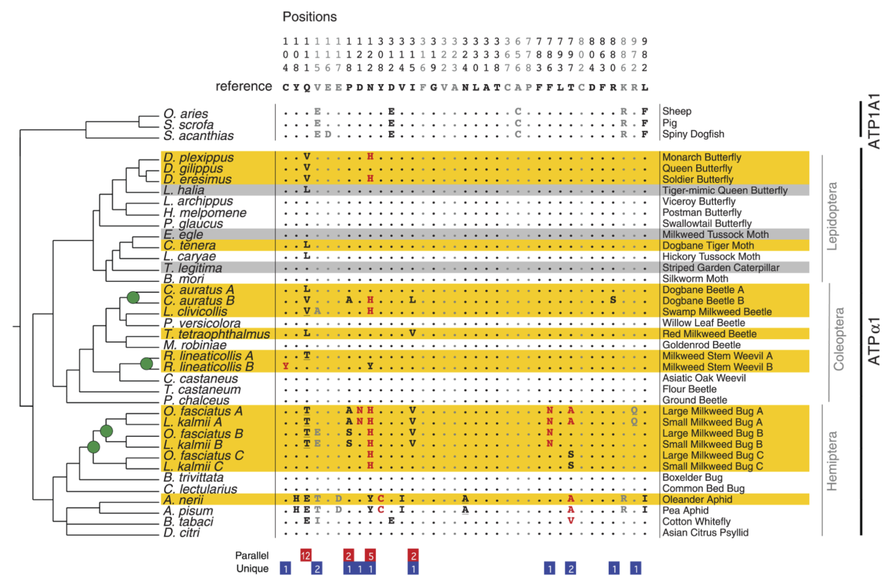

# Use-cases of visualization 

## Adaptive radiation illustration from educational web site

This example is from University of California Museum of Paleontology's [Understanding Evolution](http://evolution.berkeley.edu). It illustrates 
* time scale with tick marks and values
   * units
   * zero point registered to tips
   * labels on the time scale (mesozoic, cenozoic)
* images at the tips
* a vertical bar representing a time interval 
   * a label on the bar
* extinct branches that terminate prior to the present
* variable thickness of branches (not explained) 

## Illustrating parallelisms in insect cardenolide resistance

This is a fully loaded example. The highlighted insect species consume plants such as milkweed that produce compounds toxic or noxious to most animals.  The yellow species actually sequester cardenolides, which makes them noxious to predators.  Cardenolides bind to  ATP-alpha-1, and these insects tend to have changes in ATP-alpha-1 that confer resistance by disrupting binding.  The columns in bold are ones that have been implicated in site-directed mutagenesis in cardenolide-binding. 

* phylogeny at left is a straightforward rectangular tree 
   * it has meaningful branch lengths but no scale
   * there are green dots to indicate specific nodes
* character matrix is in the center
   * some rows are highlighted
   * columns are distinguished by grey vs. black font
   * individual char-states may have red letters to indicate parallel changes
* above the character matrix are character descriptors 
   * position, in vertically aligned text
   * reference character-state
* below the character matrix is another block of character descriptors
   * changes parallel among cardenolide-consuming insects
   * changes that are unique
* to the right of the char matrix is a column of common names (nice touch)
* at the extreme right are two sets of brackets
   * taxon brackets showing insect orders (species-tree concept)
   * ortholog brackets distinguishing ATP1A1 from ATPalpha1 (gene-tree concept)

## scrap and notes

* I like this: http://epidemic.bio.ed.ac.uk/how_to_read_a_phylogeny
* p. 2 of this http://www.calvin.edu/~rpruim/talks/SC11/2011-06/SC11-Calvin-Rendon/bioinformatics.Day2/D2.1.Reading%20Phylogenetic%20Trees.pdf .  find source on berkeley site.  use this.  
